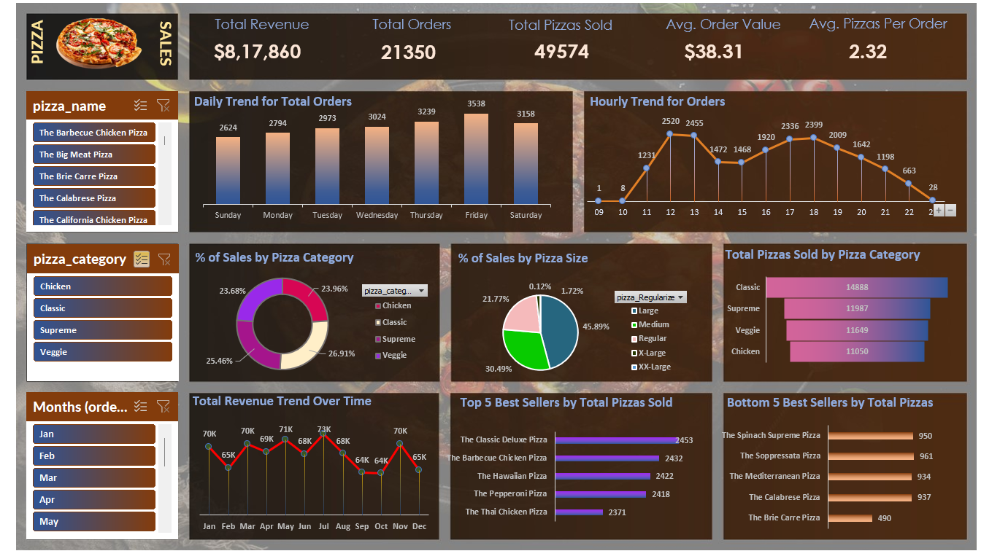

# 🍕 Pizza Sales Analysis Project

This project analyzes Pizza Sales data using **Excel Dashboard** and **SQL Queries**.  
It provides interactive visualizations, business KPIs, and detailed insights from the dataset.  

---

## 📊 Project Files
- **Pizza_Dashboard.xlsx** → Interactive Excel Dashboard  
- **Pizza_Dashboard.png** → Dashboard Screenshot  
- **pizza_sales.csv** → Dataset used for analysis  
- **PIZZA SALES QUERIES.docx** → SQL queries and calculations  
- **README.md** → Project documentation  

---

## 🏆 Key KPIs
1. **Total Revenue**  
2. **Average Order Value**  
3. **Total Pizzas Sold**  
4. **Total Orders**  
5. **Average Pizzas Per Order**  

---

## 📈 Dashboard Insights
- **Daily Trend:** Order growth per day  
- **Hourly Trend:** Peak order hours  
- **Category Contribution:** % Sales by Pizza Category  
- **Size Contribution:** % Sales by Pizza Size  
- **Top 5 Best Sellers:** Based on total pizzas sold  
- **Bottom 5 Sellers:** Identify least popular pizzas

- 

---

## 🛠 Tools Used
- **Excel** → Dashboard, Charts, KPIs  
- **SQL** → Queries & calculations for metrics  
- **CSV** → Raw dataset  

---

## 🚀 Learnings
- Data Cleaning & Transformation  
- Business KPIs calculation using SQL  
- Excel Visualization & Dashboard Design  
- Extracting Business Insights from Data  

---

## 📌 How to Use
1. Download the `pizza_sales.csv` dataset.  
2. Open and explore `Pizza_Dashboard.xlsx` to interact with slicers & charts.  
3. Review SQL queries in `PIZZA SALES QUERIES.docx`.  

---

## 🔗 Connect with Me
If you like this project or have suggestions, feel free to connect on **LinkedIn**: [www.linkedin.com/in/
jyoti-yadav-28954234b]

---
`#Excel` `#SQL` `#Dashboard` `#DataAnalytics` `#BusinessIntelligence` 
